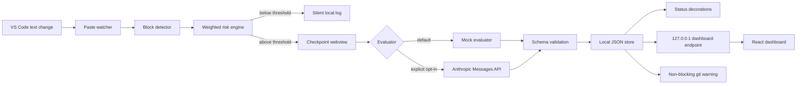

# CodeIQ

> **Code faster with AI. Understand what you ship.**

CodeIQ is a production-quality MVP for an understanding gate around AI-assisted coding. AI can help you write the code; CodeIQ makes sure you understand the code you keep. It is not an AI detector, an anti-AI tool, a code-quality linter, or a commit blocker. It uses a transparent heuristic risk score to decide when a short, contextual explanation checkpoint is worth the developer's attention.

## What is included

| Package | Purpose | Run command |
|---|---|---|
| `extension/` | Installable TypeScript VS Code extension with paste detection, risk engine, checkpoint webview, evaluation layer, decorations, local store, and git warning hook. | `cd extension && npm install && npm run compile` |
| `dashboard/` | Local React + Vite project analytics dashboard with polling against the extension's localhost data endpoint and a seeded first-run state. | `cd dashboard && npm install && npm run dev` |
| `shared/` | Shared TypeScript models and project summary calculations. | Imported by both packages |
| `seed/` | Demo store with auth, trivial, partial, and verified blocks. | Dashboard fallback data |

## Quick start

Run the following in two terminals:

```bash
cd codeiq/extension
npm install
npm run compile
```

Then open the repository root in VS Code and press `F5` to launch the Extension Development Host. In the development host, set `CodeIQ: Use Mock Evaluator` to `true` for a completely offline demo.

```bash
cd codeiq/dashboard
npm install
npm run dev
```

Open `http://localhost:4173`. When the extension is active, the dashboard polls `http://127.0.0.1:4174/data` every three seconds. Without the extension, it uses `seed/demo-store.json`, so a judge can explore the dashboard immediately.

## Demo script

1. Open a `.ts` file in the Extension Development Host and paste a 20–50 line block containing `refreshSession`, `token`, `fetch`, `db`, or similar authentication and API logic.
2. CodeIQ detects the paste-shaped insertion without recording keystrokes and labels it **likely AI-assisted or pasted** when the structure matches common generated-code signals. This is explicitly a heuristic, not proof of AI provenance.
3. CodeIQ immediately opens a non-modal explanation panel. It first gives a short local explanation of what the block appears to do, then asks a question referencing actual function and variable names so the developer can explain it in their own words.
4. The non-modal panel asks one question referencing actual symbols from the inserted code. Answer with a short explanation and select **Verify understanding**.
5. A strong answer produces **Understanding verified** and a subtle green gutter check. A partial answer names what was understood and asks one simpler follow-up question. The loop caps at two follow-ups and never traps the developer.
6. Open the dashboard to see the updated understanding percentage, verification mix, understanding debt, review queue, recent checkpoint activity, and language breakdown.
7. Run **CodeIQ: Install Commit Warning Hook** if desired. A future commit with important unverified blocks produces a warning with **Review** and **Commit Anyway**; it never blocks the commit.

## Architecture



## Privacy model

The extension is local-first. It does not collect keystrokes, does not silently exfiltrate code, and has telemetry disabled by default. `codeiq.sendCodeToLLM` defaults to `false`; in that mode the deterministic mock evaluator runs automatically and no network request is made. Live evaluation is server-side in the extension host, requires explicit opt-in, redacts common secret patterns, and uses structured validation with a safe `needs_review` fallback.

Understanding debt is a transparency metric: it means that higher-risk code has not yet had a clear explanation checkpoint. It is not a judgment about intelligence, authorship, or whether AI was used.

## Development notes

The MVP deliberately uses `.codeiq/store.json` instead of native SQLite so it remains easy to install across platforms and in a sandbox. The storage layer is isolated behind `ProjectStore`, so SQLite can be added later without changing the dashboard contract. The evaluator is isolated behind `LLMEvaluator`, allowing Anthropic, another provider, or a test double to be swapped without changing the checkpoint UI.

## License

This CodeIQ MVP is provided under the repository's existing license.
